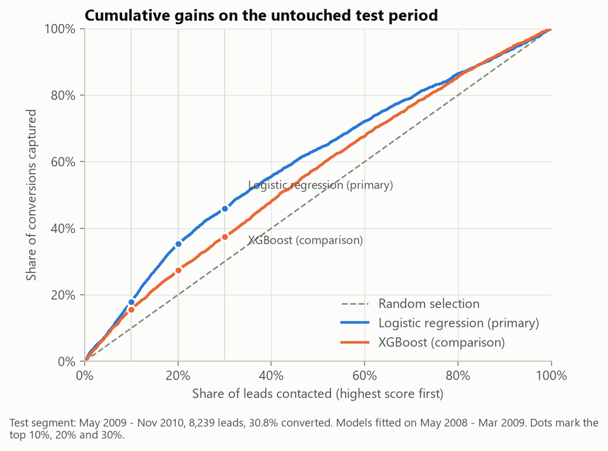
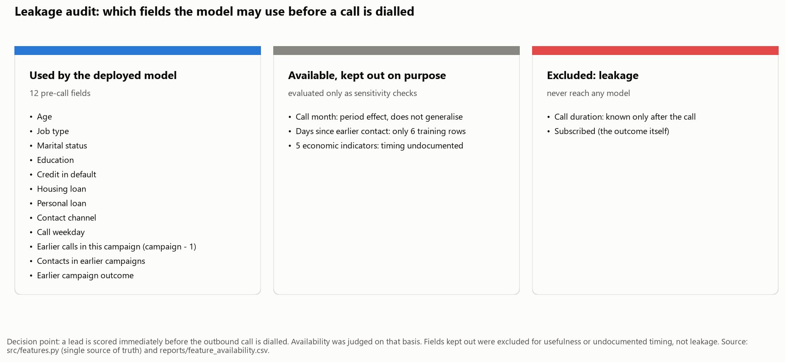
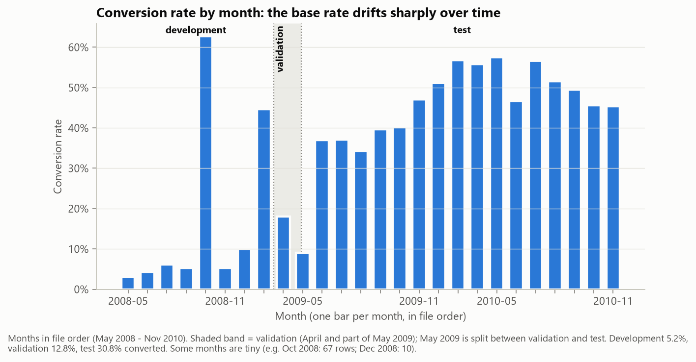
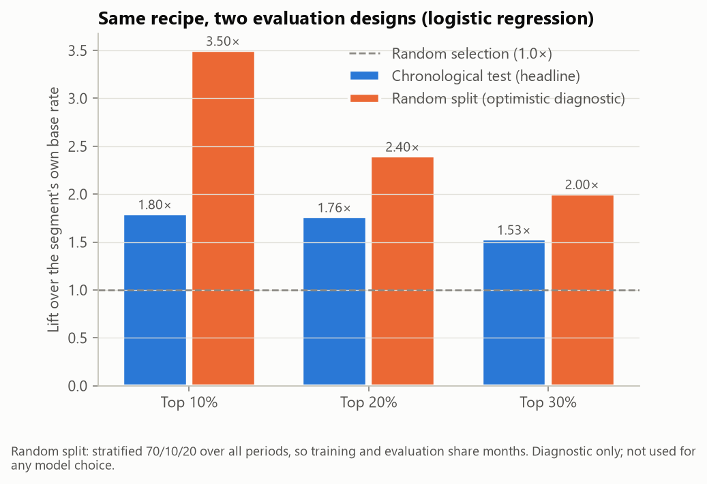
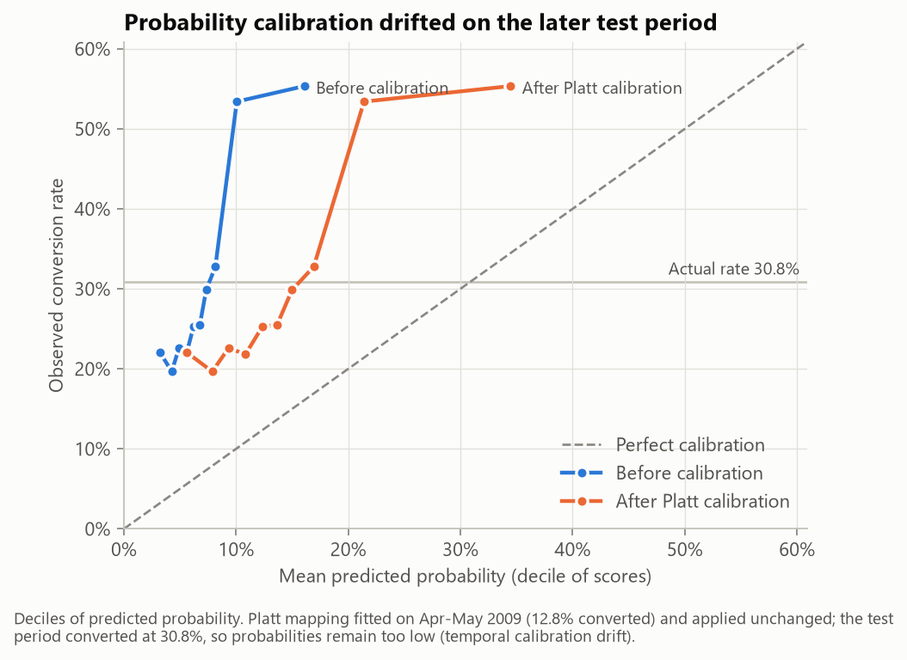
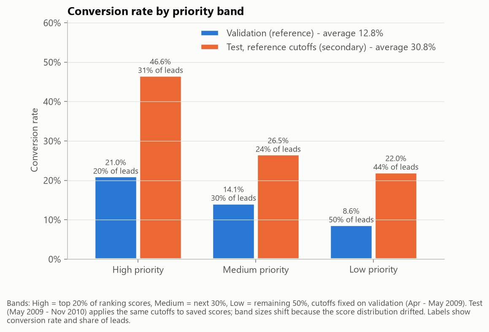
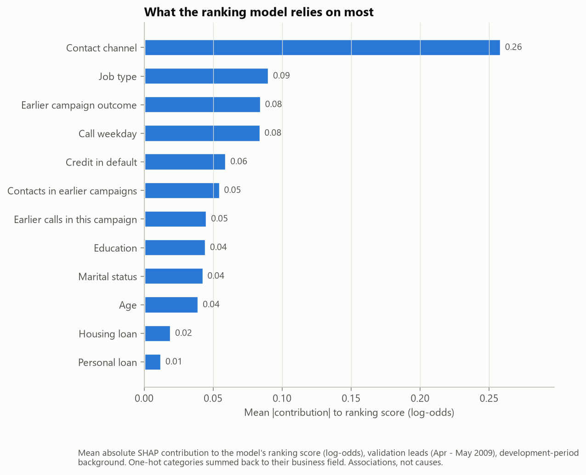
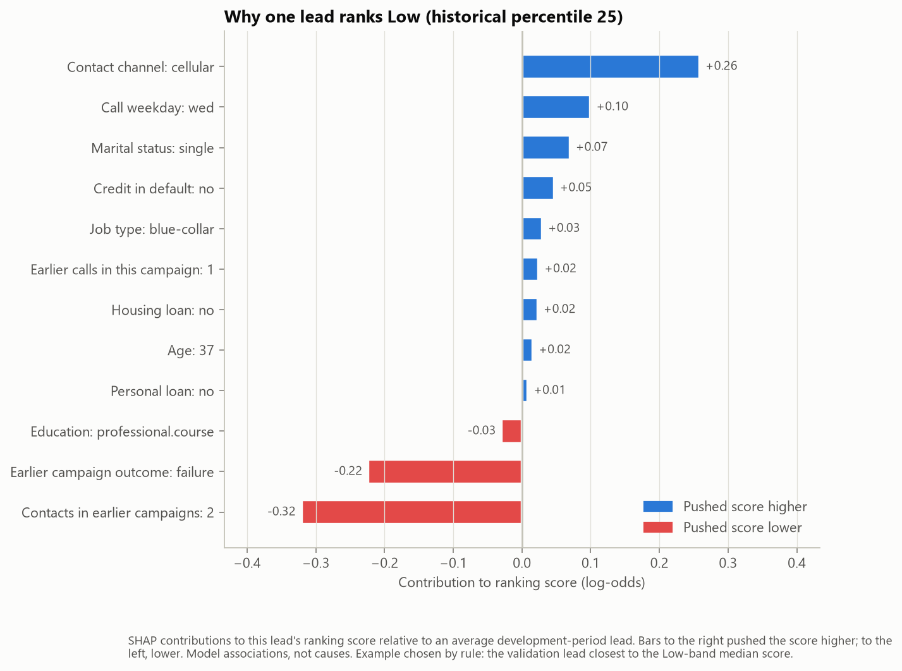
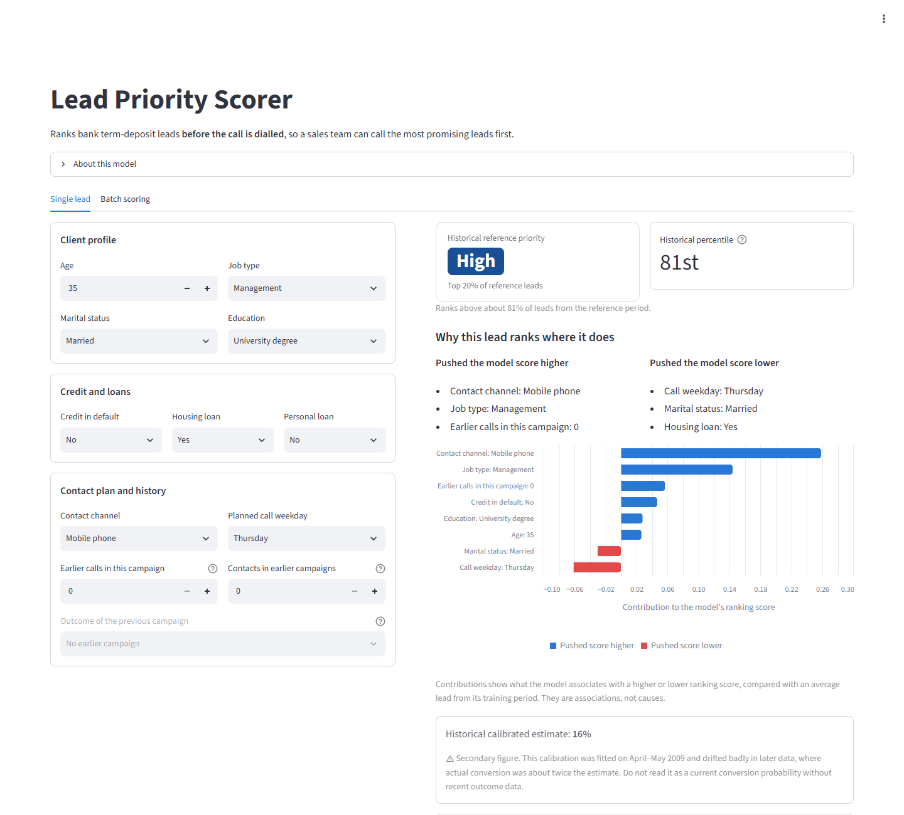
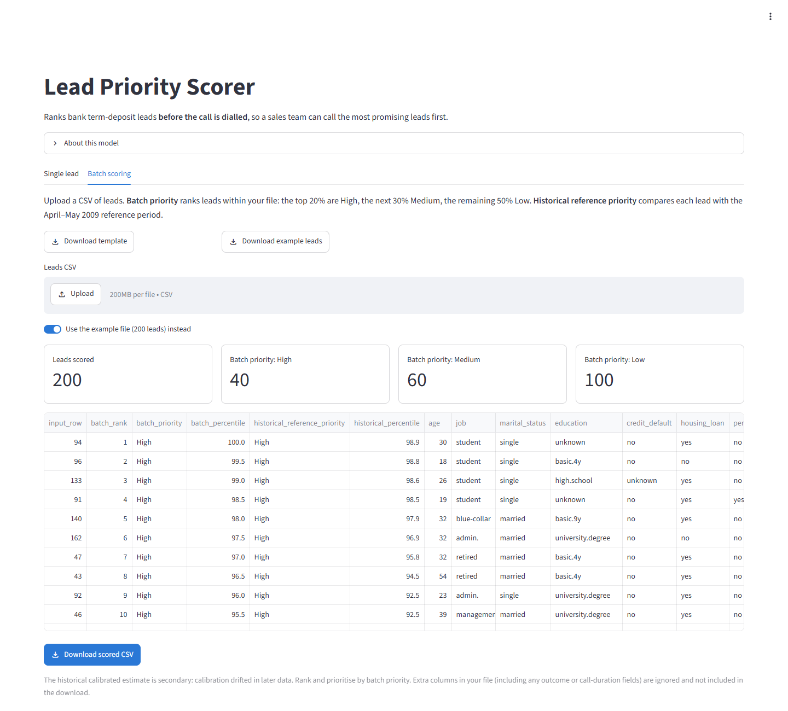

# Lead Prioritization with Leakage-Safe Machine Learning

**Which leads should a sales team call first, given only what is known before the call?**

This project builds and deploys a lead-ranking model for a bank's term-deposit telemarketing campaigns, using public
historical data. The model is designed to be realistic at the moment a decision is made. It was tested forward in
time on a later period it had never seen, and it is delivered as a small web app that ranks leads for outreach.

> **Live demo:** _[Streamlit link — add after deployment]_ · **Data:** UCI Bank Marketing (CC BY 4.0) ·
> **Status:** portfolio demonstration on public 2008–2010 data, not a production banking system.

## Results at a glance

Chronological test: 8,239 leads from May 2009 – November 2010, scored once by a model frozen on earlier data.
30.83% of these leads converted.

| If the team calls the top 20% of ranked leads… | Model ranking | Random order |
|---|---|---|
| Share of those calls that convert (precision) | **54.4%** | 30.8% |
| Share of all conversions reached | **35.3%** | 20.0% |
| Lift over random selection | **1.76×** | 1.00× |
| Contacts needed per conversion | **1.84** | 3.24 |

Ranking quality on the same test: PR-AUC **0.459** (95% interval 0.440–0.480; the random baseline equals the
30.8% conversion rate) and ROC-AUC **0.645** (0.632–0.658).



**What the project found:**

- **Strict pre-call features.** The model uses only fields known before dialling. Call duration, which leaks the
  outcome, is excluded by construction and by tests.
- **Time-aware evaluation exposed strong drift.** The conversion rate rose from 5% in the training period to 31% in
  the test period. A random
  split would have hidden this, overstated performance and picked the other model.
- **The simpler model generalised better.** Logistic regression beat XGBoost on the forward-in-time test.
- **Ranking held up; probabilities did not.** The model kept ranking leads usefully a year after its training data
  ended, but its probabilities became far too low.
- **So the app leads with priority.** It shows a High / Medium / Low priority and a percentile first. The probability
  is a clearly labelled secondary figure.

## Business problem

A bank's outreach team has more leads than it can call. Only about 11% of leads subscribe overall, so calling
everyone in arbitrary order wastes most of the team's capacity. The goal is a ranking: given a list of leads and a
limited number of calls, put the leads most likely to subscribe at the top.

The model is evaluated on what that decision needs: how many conversions the top 10%, 20% or 30% of the ranking
captures, the precision and lift in those groups, and contacts per conversion. Raw accuracy is not used. A model that
predicts "no" for everyone is 89% accurate on this data and finds nobody.

## Leakage-safe prediction point

**A lead is scored immediately before the recorded outbound call is dialled.** Every field was audited for whether
its value is actually known at that moment.



- **Call duration** is known only after the call ends, when the outcome is also known. It is excluded from every
  model. Tests fail if it, or the target, ever reaches a model, even when an uploaded file contains those columns.
- **Number of calls in this campaign** counts the call being scored. It is converted to "earlier calls in this
  campaign" (`campaign − 1`).
- **Kept out of the deployed model on purpose, and evaluated only as labelled sensitivity checks:**
  - call month: it acts as a calendar-period effect that did not generalise;
  - days since an earlier-campaign contact: only 6 of the training rows have a value;
  - five economic indicators: the dataset does not document whether their values were available at call time.

All feature decisions live in one place ([src/features.py](src/features.py)) and are tested.

## Data and feature decisions

- **Dataset.** `bank-additional-full.csv` from the UCI Machine Learning Repository: 41,188 calls by a Portuguese bank,
  May 2008 – November 2010, 11.27% subscribed. Downloaded by script from the official source
  ([scripts/download_data.py](scripts/download_data.py)).
- **Row order.** The file has no date column. The documented date order was verified from the month sequence:
  26 contiguous months.
- **Missing values.** `unknown` values are kept as their own category; nothing is imputed from the data.
- **Deployed model inputs (12).** Age, job, marital status, education, credit default, housing loan, personal loan,
  contact channel, planned call weekday, earlier calls in this campaign, contacts in earlier campaigns and the
  earlier campaign's outcome.
- **Audit details.** See [notebooks/01_data_and_leakage_audit.ipynb](notebooks/01_data_and_leakage_audit.ipynb) and
  [reports/feature_availability.csv](reports/feature_availability.csv).

## Time-aware validation

The data was split in time order, never shuffled:

| Segment | Period | Leads | Conversion rate | Used for |
|---|---|---|---|---|
| Development | May 2008 – Mar 2009 | 27,972 | 5.2% | fitting and order-preserving tuning folds |
| Validation | Apr – May 2009 | 4,977 | 12.8% | model choice, calibration, band cutoffs |
| Test | May 2009 – Nov 2010 | 8,239 | 30.8% | scored once, after everything was frozen |



- **Strong drift.** The conversion rate rises sharply over time, and earlier-campaign history becomes far more
  common. Testing on a later period with a different mix is the realistic check, and the hard one.
- **One-time test guard.** The test segment was scored once, and the code refuses to score it again or to rerun
  development afterwards.
- **Redesign before test scoring.** An earlier design (60/20/20 split, month as a feature) was revised before any
  test scoring. The reasons are archived in [reports/history/](reports/history/).

**Why it mattered.** The same frozen recipe was also run on a stratified *random* split, purely as a diagnostic.



- Top-10% lift looks about twice as good under the random split (3.50× vs 1.80×).
- Probabilities look well calibrated there.
- XGBoost comes out slightly ahead of logistic regression there, the opposite of the forward-in-time result.

Random evaluation would have overstated performance and pointed to the model that generalised worse. Absolute PR-AUC
values are not compared across the two designs because their base rates differ (11% vs 31%).

## Model comparison

Three models were compared:

- a naive constant-rate baseline;
- logistic regression, with all preprocessing inside a scikit-learn pipeline fitted on training rows only;
- XGBoost, with a conservative search space.

No SMOTE was used. Class weighting was tested, but it hurt ranking and distorted probabilities, so it was not used.

**Tuning was not informative.** Within the 2008 – early 2009 development period, every candidate scored at noise
level, so predeclared default settings were used rather than the noisy "best" candidates.

**Primary-model rule, declared before validation.** XGBoost would be chosen only if it beat logistic regression on
validation PR-AUC by at least 0.01, matched its top-20% lift, and did at least as well in every validation month.
XGBoost failed the month-stability check, so logistic regression became the primary model.

**Test results (scored once):**

| Model | PR-AUC [95% interval] | ROC-AUC [95% interval] | Top-20% precision | Top-20% lift |
|---|---|---|---|---|
| Naive baseline | 0.308 | 0.500 | 30.8% | 1.00 |
| **Logistic regression (primary)** | **0.459** [0.440, 0.480] | **0.645** [0.632, 0.658] | **54.4%** | **1.76** |
| XGBoost (comparison) | 0.391 [0.374, 0.410] | 0.588 [0.575, 0.601] | 42.2% | 1.37 |

On the same bootstrap resamples, logistic regression's advantage was +0.051 to +0.085 PR-AUC and +0.045 to +0.068
ROC-AUC. The intervals use a row bootstrap (2,000 resamples). They ignore time dependence, drift and repeated
clients; the dataset has no client ID.

## Business results

Logistic regression on the test period:

| Calls made | Leads | Conversions | Precision | Share of conversions | Lift | Contacts per conversion |
|---|---|---|---|---|---|---|
| Top 10% | 824 | 456 | 55.3% | 18.0% | 1.80 | 1.81 |
| Top 20% | 1,648 | 896 | 54.4% | 35.3% | 1.76 | 1.84 |
| Top 30% | 2,472 | 1,166 | 47.2% | 45.9% | 1.53 | 2.12 |
| Random order (any size) | — | — | 30.8% | = share called | 1.00 | 3.24 |

These are historical backtest figures, not a forecast. No dollar ROI is claimed, because the dataset contains no
costs or deposit values.

### Probability calibration drifted



The calibration was fitted on April–May 2009, when 12.8% of leads converted. On the test period it predicted 14.7%
on average, against an actual 30.8%. Brier score was 0.262 before calibration and 0.228 after, still worse than the
0.213 from always predicting the test period's own rate (a rate nobody knows in advance). The scores rank well but
are not reliable probabilities without recent outcome data. This is why the app does not lead with a probability.

## Priority bands

The bands come from a fixed rank rule, not probability thresholds: **High = top 20%** of ranking scores,
**Medium = next 30%**, **Low = remaining 50%**. The cutoffs were taken from the validation period and frozen before
any band-level test results were computed.



| Band | Validation conversion (lift) | Test conversion, batch-relative bands (lift) |
|---|---|---|
| High | 21.0% (1.64×) | 54.4% (1.76×) |
| Medium | 14.1% (1.11×) | 29.4% (0.95×) |
| Low | 8.6% (0.68×) | 22.3% (0.72×) |

- **Band order holds.** Conversion falls from High to Medium to Low in both periods.
- **Medium and Low separate weakly on test.** Most of the useful signal is in the High band.
- **Historical cutoffs drift.** Applied to the later period, the fixed validation cutoffs put 31.5% of test leads in
  High, because scores drifted upward. The app therefore emphasises **batch-relative** bands (top 20% of the
  uploaded list) and shows the historical band separately.
- **Confusion matrices** at both operating points (call High only; call High + Medium) are in
  [reports/threshold_analysis.csv](reports/threshold_analysis.csv).

## Explainability

SHAP contributions explain the logistic ranking score, not a probability. The reference ("average lead") is the
development period. One-hot categories are summed back to business fields.



**Associations the model relies on.** These describe the model, not causes of conversion:

- Mobile contact pushed scores up and landline down.
- A previous-campaign success pushed scores up; previous failures, and more earlier-campaign contacts, pushed them
  down.
- Students and retired clients were pushed up.
- More calls already made in this campaign pushed scores down.



**Where the model falls short.**

- **Weekday pattern reversed.** In 2008 Friday and Wednesday calls converted slightly better and the model learned
  that. In the April–May 2009 validation period Thursday calls converted best (18%) and Friday calls worst (7%).
- **Age is modelled as a single linear trend.** It scores clients over 60 lower, although that small group converted
  at high rates in both periods: 44% of 39 leads in development, 39% of 104 in validation.

Both help explain the moderate lift. They point to retraining on recent data and to a more flexible treatment of
age.

## Streamlit app

The app loads a small committed model file (51 KB). It never trains, never downloads the dataset and does not need
XGBoost or SHAP to run.

- **Single lead.**
  - **Primary outputs:** historical reference priority (High / Medium / Low), the historical percentile, and the top
    factors that pushed the model score higher or lower.
  - **Secondary output:** a "historical calibrated estimate", shown with a drift warning.
  - **Input checks:** inputs use business labels, and impossible combinations are prevented. For example, a previous
    campaign outcome cannot be set when there were no earlier-campaign contacts.
- **Batch scoring.**
  - Upload a CSV (template provided, or the raw UCI format), or use the built-in 200-lead example file.
  - Columns: `batch_priority` and `batch_percentile` (ranked within the file: top 20% / next 30% / remaining 50%),
    `historical_reference_priority`, `historical_percentile`, the ranking score and the secondary estimate.
  - Download the scored CSV. Extra columns such as call duration or outcome are dropped.

| Single lead | Batch scoring |
|---|---|
|  |  |

_Screenshots are from a local run; replace with screenshots of the deployed app._

## Limitations

- **Old, single-source data.** One Portuguese bank, 2008–2010, spanning the financial crisis. This is a historical
  backtest, not evidence about any other business or period.
- **Prioritisation, not uplift.** The model ranks who tended to subscribe; it does not estimate whether a call
  *causes* a subscription. Contributions are associations.
- **Drift.** Conversion rates and population mix changed sharply. Relationships learned on 2008 data weakened or
  reversed, and probability calibration failed on later data. A real deployment would monitor results and retrain
  and recalibrate on recent outcomes.
- **Dataset structure.**
  - There are no timestamps or client IDs. Ordering is inferred from the month sequence, and a client may appear in
    several periods.
  - Rows are final contacts per campaign.
  - May 2009 is split between validation and test.
- **Thin early history.** The training period contains very few earlier-campaign successes (38).
- **Fairness.** Inputs include age, marital status and education. Using such attributes for targeting may be
  restricted or inappropriate in some settings; review with legal and compliance before any real use.
- **Uncertainty intervals.** They assume independent rows and understate real-world uncertainty.

## Repository structure

```
app.py                         Streamlit app (loads the committed deployment artifact only)
app_assets/example_leads.csv   200 example leads for the app (UCI data, outcome removed)
artifacts/models/              lead-scorer-1.0.0-deploy.joblib + .json (committed); full artifacts are git-ignored
notebooks/                     01 data and leakage audit · 02 modelling and evaluation · 03 bands and explanations
reports/                       one-time test metrics, validation results, band tables, SHAP outputs, figures
  phase2_3_results.md          detailed write-up of validation design, models and test results
  phase4_results.md            priority bands, explanations, deployment artifact
  history/                     archived first design (revised before any test scoring)
scripts/                       download, audit, train/evaluate, figures, bands/explanations, deployment artifact
src/                           features (single source of truth), splits, modelling, evaluation, explainability,
                               inference, app logic, plots
tests/                         unit, integration and Streamlit smoke tests
```

## Local setup

**Run the app.** Use Python 3.12; the committed model file was built and tested with the pinned versions.

```bash
git clone <repository-url>
cd <repository-folder>
python -m venv .venv
# Windows: .venv\Scripts\activate    macOS/Linux: source .venv/bin/activate
pip install -r requirements.txt
streamlit run app.py
```

No dataset download or training is needed.

**Full development environment** (data audit, modelling, explanations, notebooks, tests):

```bash
pip install -r requirements-dev.txt
python scripts/download_data.py        # official UCI archive -> data/raw/ (not committed)
```

### Reproducing the analysis

The committed `reports/` are the one-time results. The pipeline guards them: once the test segment has been scored,
development and test scoring refuse to run again. To reproduce from scratch, work in a fresh copy:

1. Delete the generated outputs:
   - in `reports/`: `metrics.json`, `test_scores.csv`, `calibration_*.csv`, `random_split_diagnostic.json`,
     `frozen_spec.json`, `validation_metrics.json`, `cv_*.csv`, `error_analysis_validation.csv`,
     `priority_rule.json`, `bands_*.csv`, `threshold_analysis.csv` and `shap_*`;
   - in `artifacts/models/`: all `.joblib` and `.json` files.
2. Run:

```bash
python scripts/run_audit.py
python scripts/train_evaluate.py develop
python scripts/train_evaluate.py freeze
python scripts/train_evaluate.py test
python scripts/train_evaluate.py random-split-diagnostic
python scripts/make_figures.py
python scripts/build_phase4.py freeze-bands
python scripts/build_phase4.py test-bands
python scripts/build_phase4.py explain
python scripts/build_phase4.py threshold-analysis
python scripts/build_deployment_artifact.py
```

All randomness is seeded. A from-scratch rerun reproduced every report and figure byte-for-byte, and produced a
deployment artifact with identical outputs.

## Testing

```bash
pytest
```

The suite checks:

- **leakage exclusions:** forbidden columns never reach a model, even when present in the input;
- **splits:** time-ordered and contiguous;
- **preprocessing:** fitted on training rows only;
- **metrics and bands:** metric calculations, and band boundaries and ties;
- **no refitting at inference:** every `fit` call is blocked during scoring;
- **artifacts:** the deployment artifact reproduces the full artifact exactly, and SHAP agrees with the closed-form
  contributions;
- **app inputs and outputs:** validation of impossible inputs, and the downloadable columns;
- **Streamlit smoke test:** the app renders and behaves as expected;
- **README numbers:** the headline figures in this README match the saved results.

Tests that need the raw dataset are skipped when it has not been downloaded.

## Data attribution and license

**Dataset:** Moro, S., Rita, P., & Cortez, P. (2014). *Bank Marketing* [Dataset]. UCI Machine Learning Repository.
<https://doi.org/10.24432/C5K306>. Licensed under
[Creative Commons Attribution 4.0 International (CC BY 4.0)](https://creativecommons.org/licenses/by/4.0/).

**Introductory paper:** S. Moro, P. Cortez and P. Rita. *A Data-Driven Approach to Predict the Success of Bank
Telemarketing.* Decision Support Systems (2014). <https://doi.org/10.1016/j.dss.2014.03.001>

This repository redistributes small derived extracts under that licence: example leads without outcomes, and test
scores with outcomes. See [DATA_ATTRIBUTION.md](DATA_ATTRIBUTION.md) for details and the changes made. The raw
dataset is not committed.

**Code licence:** the source code in this repository is released under the [MIT License](LICENSE). The MIT License
covers the code only. The dataset and the data-derived files listed in [DATA_ATTRIBUTION.md](DATA_ATTRIBUTION.md)
remain under CC BY 4.0 with the attribution above.
